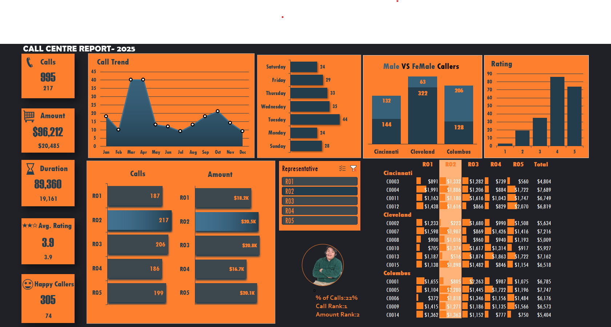

# 📊 Call Center Performance Analysis – Excel Dashboard

## 📌 Overview
This project analyzes call center operational and customer data to uncover insights related to call volume, revenue generation, customer satisfaction, and agent performance. Using **Microsoft Excel**, the project demonstrates end-to-end data analytics skills — from data cleaning and exploratory analysis to dashboard creation — enabling clear and data-driven decision-making.

---

## 📂 Dataset
- The dataset consists of call center records containing:
  - Call volume and call duration  
  - Revenue generated per call  
  - Customer ratings and satisfaction indicators  
  - Agent performance metrics  
  - Location and time-based attributes  
- The Excel file includes:
  - Raw data  
  - Cleaned and transformed datasets  
  - Final dashboard output  

---

## 🛠 Tools & Technologies
- Microsoft Excel  
- Power Query  
- Excel Formulas  
- Pivot Tables & Pivot Charts  
- Data Cleaning & Transformation  
- Exploratory Data Analysis  
- Dashboard Design & Data Visualization  

---

## 🔍 Analysis Workflow
1. **Data Cleaning**
   - Removed duplicates and handled missing or inconsistent values  
   - Standardized data formats and data types  

2. **Data Transformation**
   - Used **Power Query** to load, transform, and prepare data  
   - Created calculated fields using Excel formulas  

3. **Exploratory Data Analysis**
   - Analyzed call trends across months and days  
   - Evaluated customer ratings and satisfaction patterns  
   - Compared agent-level performance metrics  

4. **Aggregation & Reporting**
   - Built **Pivot Tables** to calculate KPIs such as total calls, revenue, average ratings, and call duration  

---

## 📊 Excel Dashboard
- Developed an **interactive Excel dashboard** presenting:
  - Total calls, revenue, average rating, and call duration  
  - Monthly call trends and weekday analysis  
  - Agent-wise performance and revenue contribution  
  - Customer satisfaction distribution  
- Implemented slicers and filters for dynamic data exploration.

📷 *A snapshot of the final dashboard is included in this repository.*

---

## 📈 Key Insights
- Identified peak call periods and high-volume days  
- Highlighted top-performing agents based on calls handled and revenue generated  
- Observed strong correlation between call handling efficiency and customer ratings  
- Provided visibility into customer satisfaction trends across locations  

---

## 🏁 Conclusion
This project demonstrates practical **data analytics and Excel dashboarding skills**, showcasing the ability to convert raw data into actionable insights. The final dashboard enables stakeholders to quickly monitor performance, identify trends, and make informed business decisions.
